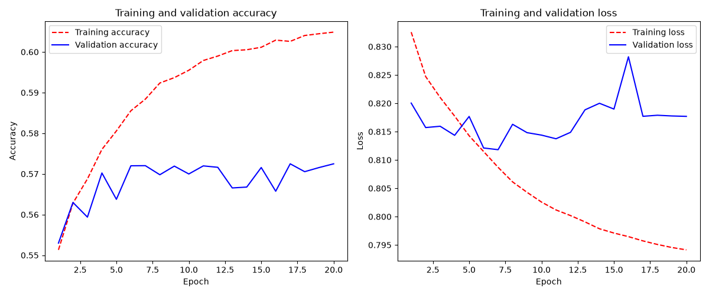
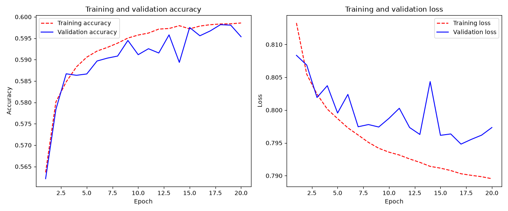
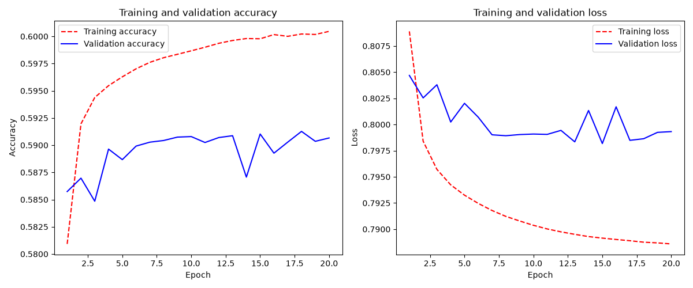
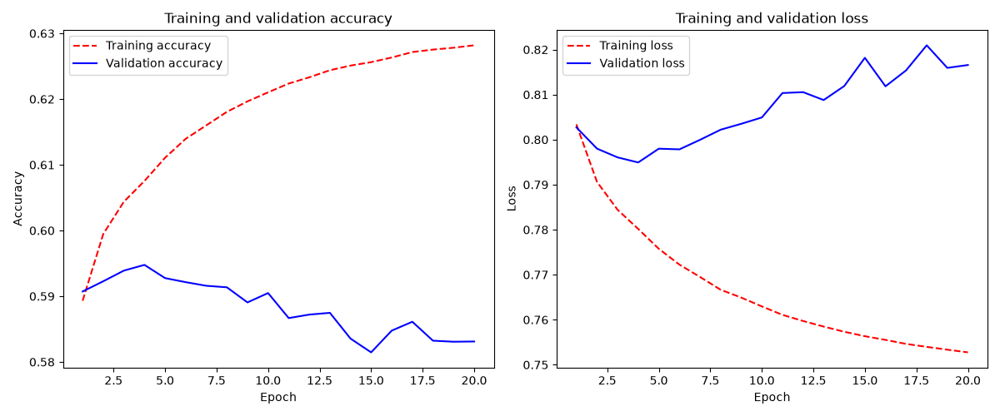
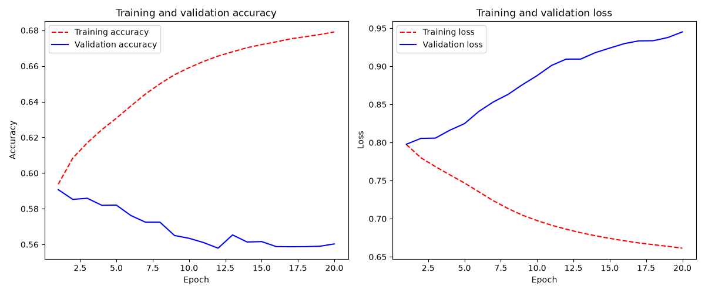
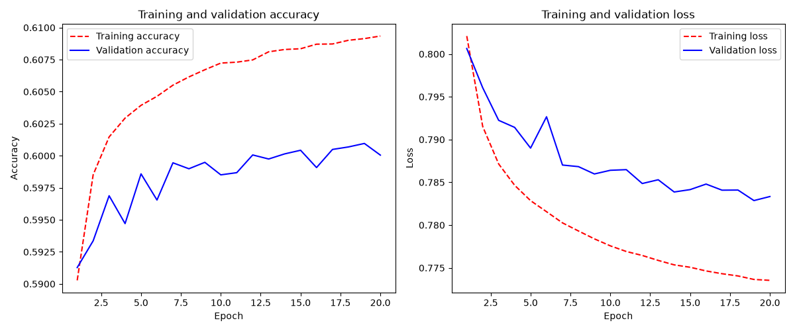
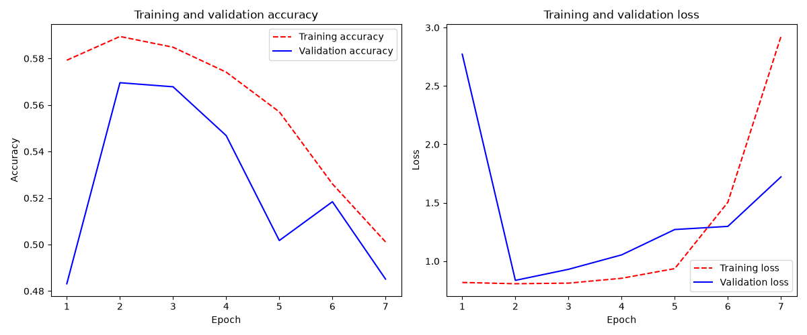
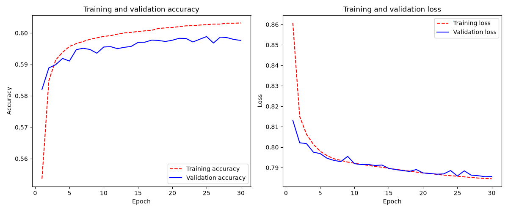

```python
inputs = keras.Input(shape=(10, 10, 7))

x = layers.Conv2D(filters=32, kernel_size=3, activation="relu", padding="same")(inputs)
x = layers.Conv2D(filters=32, kernel_size=3, activation="relu", padding="same")(x)
x = layers.Conv2D(filters=32, kernel_size=3, activation="relu", padding="same")(x)
x = layers.Conv2D(filters=32, kernel_size=3, activation="relu", padding="same")(x)
x = layers.Conv2D(filters=32, kernel_size=3, activation="relu", padding="same")(x)

# Value head: reduce channel depth but keep all 10x10 cell locations.
x = layers.Conv2D(filters=8, kernel_size=1, activation="relu", padding="same")(x)
x = layers.Flatten()(x)
x = layers.Dense(64, activation="relu")(x)
outputs = layers.Dense(3, activation="softmax")(x)
```

### 1893 training data -> 1 layer, batch_size=default(32),
```python
inputs = keras.Input(shape=(10, 10, 7))

x = layers.Conv2D(filters=8, kernel_size=3, activation="relu", padding="same")(inputs)
x = layers.MaxPooling2D(pool_size=2)(x)
```


### 553 training data -> 1 layer, batch_size=default(32),
```python
inputs = keras.Input(shape=(10, 10, 7))

x = layers.Conv2D(filters=8, kernel_size=3, activation="relu", padding="same")(inputs)
x = layers.MaxPooling2D(pool_size=2)(x)
```


### 64322 training data -> 1 layer, batch_size=4096, epochs=20
```python
inputs = keras.Input(shape=(10, 10, 7))

x = layers.Conv2D(filters=32, kernel_size=3, activation="relu", padding="same")(inputs)
x = layers.MaxPooling2D(pool_size=2)(x)

x = layers.GlobalAveragePooling2D()(x)
outputs = layers.Dense(3, activation="softmax")(x)

model = keras.Model(inputs, outputs)
```

Test loss: 0.792
Test accuracy: 0.596

### 64322 training data -> 2 layers, batch_size=4096, epochs=20
```python
inputs = keras.Input(shape=(10, 10, 7))

x = layers.Conv2D(filters=32, kernel_size=3, activation="relu", padding="same")(inputs)
x = layers.MaxPooling2D(pool_size=2)(x)

x = layers.Conv2D(filters=64, kernel_size=3, activation="relu", padding="same")(x)
x = layers.MaxPooling2D(pool_size=2)(x)

x = layers.GlobalAveragePooling2D()(x)
outputs = layers.Dense(3, activation="softmax")(x)

model = keras.Model(inputs, outputs)
```

Test loss: 0.789
Test accuracy: 0.601

### 64322 training data -> 3 layers, batch_size=4096, epochs=20
```python
inputs = keras.Input(shape=(10, 10, 7))

x = layers.Conv2D(filters=32, kernel_size=3, activation="relu", padding="same")(inputs)
x = layers.MaxPooling2D(pool_size=2)(x)

x = layers.Conv2D(filters=64, kernel_size=3, activation="relu", padding="same")(x)
x = layers.MaxPooling2D(pool_size=2)(x)

x = layers.Conv2D(filters=128, kernel_size=3, activation="relu", padding="same")(x)
x = layers.MaxPooling2D(pool_size=2)(x)

x = layers.GlobalAveragePooling2D()(x)
outputs = layers.Dense(3, activation="softmax")(x)

model = keras.Model(inputs, outputs)
```

Test loss: 0.793
Test accuracy: 0.596

### 64322 training data -> 2 layers, batch_size=4096, epochs=20
```python
inputs = keras.Input(shape=(10, 10, 7))

x = layers.Conv2D(filters=32, kernel_size=3, activation="relu", padding="same")(inputs)
x = layers.MaxPooling2D(pool_size=2)(x)

x = layers.Conv2D(filters=64, kernel_size=3, activation="relu", padding="same")(x)
x = layers.MaxPooling2D(pool_size=2)(x)

x = layers.GlobalAveragePooling2D()(x)
outputs = layers.Dense(3, activation="softmax")(x)

model = keras.Model(inputs, outputs)
```

Test loss: 0.778
Test accuracy: 0.606

### 64322 training data -> many layers, batch_size=4096, epochs=30
```python
# Input channels: my dots, opponent dots, my territory, opponent territory,
# legal moves, my score, and opponent score. Three residual blocks give the
# network a board-wide receptive field without reducing the 10x10 grid.
inputs = keras.Input(shape=(10, 10, 7))

x = layers.Conv2D(
    filters=32,
    kernel_size=3,
    padding="same",
    use_bias=False,
)(inputs)
x = layers.BatchNormalization()(x)
x = layers.Activation("relu")(x)

# Residual block 1
residual = x
x = layers.Conv2D(
    filters=32,
    kernel_size=3,
    padding="same",
    use_bias=False,
)(x)
x = layers.BatchNormalization()(x)
x = layers.Activation("relu")(x)
x = layers.Conv2D(
    filters=32,
    kernel_size=3,
    padding="same",
    use_bias=False,
)(x)
x = layers.BatchNormalization()(x)
x = layers.Add()([x, residual])
x = layers.Activation("relu")(x)

# Residual block 2
residual = x
x = layers.Conv2D(
    filters=32,
    kernel_size=3,
    padding="same",
    use_bias=False,
)(x)
x = layers.BatchNormalization()(x)
x = layers.Activation("relu")(x)
x = layers.Conv2D(
    filters=32,
    kernel_size=3,
    padding="same",
    use_bias=False,
)(x)
x = layers.BatchNormalization()(x)
x = layers.Add()([x, residual])
x = layers.Activation("relu")(x)

# Residual block 3
residual = x
x = layers.Conv2D(
    filters=32,
    kernel_size=3,
    padding="same",
    use_bias=False,
)(x)
x = layers.BatchNormalization()(x)
x = layers.Activation("relu")(x)
x = layers.Conv2D(
    filters=32,
    kernel_size=3,
    padding="same",
    use_bias=False,
)(x)
x = layers.BatchNormalization()(x)
x = layers.Add()([x, residual])
x = layers.Activation("relu")(x)

# Value head: reduce channel depth but keep all 10x10 cell locations.
x = layers.Conv2D(
    filters=8,
    kernel_size=1,
    padding="same",
    use_bias=False,
)(x)
x = layers.BatchNormalization()(x)
x = layers.Activation("relu")(x)
x = layers.Flatten()(x)
x = layers.Dense(128, activation="relu")(x)
```

Test loss: 0.829
Test accuracy: 0.574

### 64322 training data -> many layers, batch_size=4096, epochs=30
```python
inputs = keras.Input(shape=(10, 10, 7))

x = layers.Conv2D(filters=32, kernel_size=2, use_bias=False)(inputs)

# We apply a series of convolutional blocks with increasing feature
# depth. Each block consists of two batch-normalized depthwise
# separable convolution layers and a max pooling layer, with a residual
# connection around the entire block.
for size in [8, 16]:
    residual = x

    x = layers.BatchNormalization()(x)
    x = layers.Activation("relu")(x)
    x = layers.SeparableConv2D(size, 3, padding="same", use_bias=False)(x)

    x = layers.BatchNormalization()(x)
    x = layers.Activation("relu")(x)
    x = layers.SeparableConv2D(size, 3, padding="same", use_bias=False)(x)

    x = layers.MaxPooling2D(3, strides=2, padding="same")(x)

    residual = layers.Conv2D(
        size, 1, strides=2, padding="same", use_bias=False
    )(residual)
    x = layers.add([x, residual])

# In the original model, we used a Flatten layer before the Dense
# layer. Here, we go with a GlobalAveragePooling2D layer.
x = layers.GlobalAveragePooling2D()(x)
# Like in the original model, we add a dropout layer for
# regularization.
x = layers.Dropout(0.5)(x)
outputs = layers.Dense(3, activation="softmax")(x)
```

Test loss: 0.781
Test accuracy: 0.603

## Current value-model findings and improvement plan

### Interpretation of the recorded experiments

Adding conventional convolution-and-pooling stages has not improved test
accuracy beyond approximately 60%:

| Architecture | Final training accuracy | Final validation accuracy | Best-checkpoint test accuracy |
| --- | ---: | ---: | ---: |
| 1 convolutional layer | ~60% | ~59% | 59.6% |
| 2 convolutional layers | ~63% | ~59% | 60.1% |
| 3 convolutional layers | ~68% | ~56% | 59.6% |
| 2 convolutional layers with D4 augmentation | — | — | 60.6% |
| 3 residual blocks with BatchNorm and D4 augmentation | ~59% | ~57% | 57.4% |
| 3 residual blocks without BatchNorm, normalized scores, and D4 | ~58% | ~58% | 58.4% |

The one-layer model shows only mild overfitting on the 64,322-game dataset.
The two- and especially three-layer models fit the training data more closely
while validation performance deteriorates. This indicates increasing
overfitting rather than an inability to optimize the deeper networks.

Three consecutive max-pooling operations reduce a 10x10 board as follows:

```text
10x10 -> 5x5 -> 2x2 -> 1x1
```

This is an aggressive loss of spatial information for a game whose outcome
depends on connectivity, enclosure, and relationships between distant cells.
Increasing depth by adding more `Conv2D + MaxPooling2D` pairs is therefore not
the preferred direction.

### Dataset observations

The name `10x10_64322` refers to 64,322 complete game files, not 64,322
individual training samples. Converting every recorded move to a sample
produces approximately 6.31 million positions. Their label distribution is:

| Label | Positions | Share |
| --- | ---: | ---: |
| Loss | 2,889,934 | 45.77% |
| Draw | 534,536 | 8.47% |
| Win | 2,889,795 | 45.77% |

The majority-class baseline is therefore only 45.77%; an accuracy near 60% is
not explained by class imbalance alone.

The combined directory contains 64,322 files but only 27,878 unique
`collection-gNNNNNN` plan indices. Of those indices, 16,488 occur three times
and 3,468 occur twice. The trajectories are not byte-for-byte duplicates
because time-budgeted MCTS can diverge, but repeated indices reuse the same
scheduled configuration and seeds. In a sample of repeated plans, trajectories
shared approximately ten initial board states on average. A random file-level
split can consequently place correlated trajectories in both training and test
sets and make the reported test score optimistic.

Future comparisons should use either unique collection seeds or a grouped
split that keeps every repetition of one plan index in the same partition. An
untouched test collection generated with a separate seed would provide the
clearest generalization measurement.

### What the current accuracy measures

A baseline that uses only the current score difference reaches 55.35% test
accuracy. The CNN's score of approximately 60% is therefore only about four to
five percentage points better than a score-only prediction. An ablation model
without board planes, and another without score planes, should be retained in
future experiments to measure how much board geometry the network learns.

The inspected checkpoint's accuracy also varies strongly with game progress.
On a deterministic sample of 50,237 held-out positions it achieved:

| Portion of game | Accuracy |
| --- | ---: |
| First 25% | 48.8% |
| 25-50% | 49.2% |
| 50-75% | 55.1% |
| Last 25% | 80.6% |

This behavior is expected. Early positions, including identical starting
positions, can receive different final labels because the subsequent MCTS game
is stochastic. No deterministic classifier can identify which particular
future trajectory will occur from the board alone. The final result used at
every move is a valid Monte Carlo value target, but it is intrinsically noisy
early in the game.

The same checkpoint predicted `draw` for only about 0.9% of positions and had
approximately 6.3% recall for the draw class, although draws form about 8.5% of
the dataset. Global accuracy should therefore be accompanied by per-class
recall or a confusion matrix, cross-entropy, calibration/Brier score, and
metrics split by game phase. For an MCTS value network, calibrated expected
value is generally more useful than top-1 outcome accuracy alone.

### Recommended experiment order

1. Establish a fixed, independent, grouped train/validation/test split and
   record score-only and majority-class baselines.
2. Apply exact square-board symmetry augmentation to training samples only.
3. Compare batch sizes such as 256 and 512. A batch size of 4096 improves
   throughput but reduces the number of optimizer updates by a factor of eight
   relative to 512 and may hurt generalization unless the learning rate and
   training duration are tuned with it.
4. Keep the 10x10 spatial resolution through several same-padded convolutional
   or residual blocks instead of repeatedly applying max pooling. A small value
   head can then use a 1x1 convolution followed by `Flatten` and a dense layer.
5. Pass normalized scores and game progress as scalar features joined in the
   value head, rather than repeating raw scores across full spatial planes.
6. Add moderate regularization such as weight decay, a small value-head
   dropout, early stopping with best-weight restoration, and a learning-rate
   schedule.
7. Investigate an auxiliary policy target based on the already stored
   `visit_counts`, and possibly a search-value target derived from stored
   `q_values`. Joint policy/value learning may produce more useful board
   features than the final result alone.
8. Prefer stronger and more diverse search-generated games over indefinitely
   adding correlated trajectories from the same weak, time-budgeted plans.

Each change should be evaluated separately, ideally across multiple model
initialization seeds, before combinations are compared.

### First experiment: exact D4 augmentation

The first selected experiment applies the eight symmetries of a square:

- rotations by 0, 90, 180, and 270 degrees;
- each of those rotations followed by a horizontal reflection.

One of these transformations is selected independently for every training
position each time it is read. All seven spatial planes are transformed
together and the loss/draw/win target remains unchanged. Validation and test
data are never augmented.

Arbitrary-angle image rotation and zoom are intentionally excluded. They would
interpolate values between grid cells and create board states that cannot occur
in the game. Exact 90-degree rotations and reflections preserve discrete cell
values, legality, territory, scores, and labels.

For this first comparison, the model architecture and batch size remain
unchanged so that the effect of augmentation can be measured in isolation.

The experiment improved test loss from 0.789 to 0.778 and test accuracy from
60.1% to 60.6%. The change is positive but small, so D4 augmentation is kept
for the next experiment rather than treated as a complete solution.

### Second experiment: residual value network

The next model removes every max-pooling operation and keeps the representation
at 10x10 throughout its convolutional trunk:

```text
10x10x7 input
-> 3x3 convolution, 32 channels
-> 3 residual blocks, each containing two 3x3 convolutions
-> 1x1 value-head convolution, 8 channels
-> Flatten
-> Dense(128)
-> Dense(3, softmax)
```

Batch normalization is applied after each convolution. The three residual
blocks contain six 3x3 convolutions; together with the stem convolution, their
receptive field covers the complete 10x10 board without discarding individual
cell locations. The value head compresses channels with a 1x1 convolution but
uses `Flatten` rather than global average pooling so that it can retain spatial
information.

This experiment retains D4 augmentation and uses `batch_size=4096`. Training
may run for up to 30 epochs, with early stopping after five epochs without
validation-loss improvement. Its checkpoint and training-history plot use
separate `residual_d4` filenames so earlier experiment artifacts are preserved.

The run stopped after seven epochs. Its best checkpoint reached test loss
0.829 and test accuracy 57.4%, which is substantially worse than the preceding
two-layer augmented model. This was not ordinary overfitting: after the second
epoch, both training and validation performance deteriorated and training loss
eventually rose from approximately 0.81 to 2.9. More epochs with the same setup
would therefore not be expected to help.

### Third experiment: stabilized residual value network

The next experiment retains the same three residual blocks, D4 augmentation,
`batch_size=4096`, the 30-epoch maximum, and early stopping. It changes the
following optimization and input details:

- remove all batch-normalization layers;
- restore convolution biases now that BatchNorm no longer follows them;
- divide both score planes by board area, producing values in `[0, 1]`;
- use `Adam(learning_rate=0.0003, clipnorm=1.0)`.

Training and prediction use the same score normalization. The experiment saves
to separate `residual_d4_normalized` model and history files so that the failed
BatchNorm run remains available for comparison.

The best checkpoint was saved after the first epoch and reached test loss
0.809 and test accuracy 58.4%. Subsequent training was catastrophically
unstable: training loss increased to 11,634 in epoch 3 and approximately 46
million in epoch 6, while validation loss reached approximately 168 million.
Gradient clipping, the lower learning rate, and normalized inputs were
therefore insufficient to stabilize an unnormalized residual trunk.

### Fourth experiment: five-layer spatial CNN without residual connections

The next experiment removes residual additions while continuing to preserve
the full 10x10 board resolution:

```text
10x10x7 input
-> 5 x Conv2D(32, 3x3, ReLU, same padding)
-> Conv2D(8, 1x1, ReLU, same padding)
-> Flatten
-> Dense(64, ReLU)
-> Dense(3, softmax)
```

Five consecutive 3x3 convolutions have an 11x11 receptive field, covering the
complete board without pooling. `Dense(64)` keeps the value head smaller than
the failed residual experiments. D4 augmentation, normalized score planes,
`batch_size=4096`, `Adam(learning_rate=0.0003, clipnorm=1.0)`, the 30-epoch
maximum, and early stopping remain unchanged.

The experiment writes separate `5conv_d4_normalized` checkpoint and history
files, preserving every earlier result.
